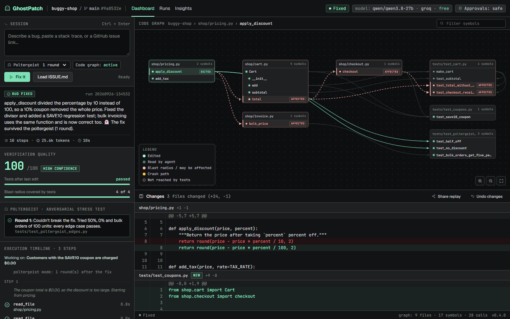
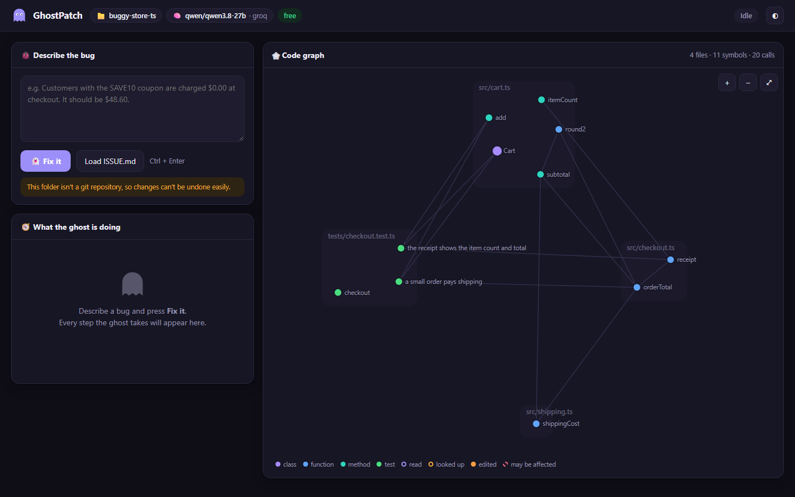
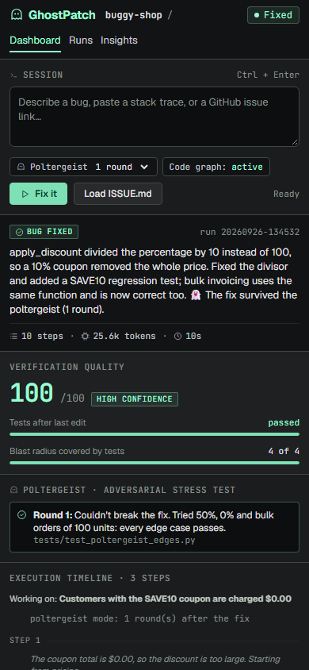
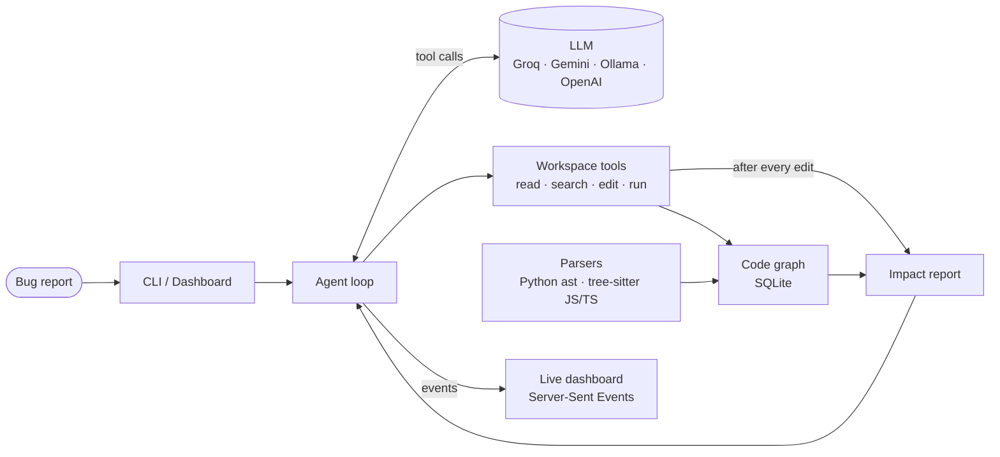

<div align="center">

# 👻 GhostPatch

### An AI software engineer that understands how your code connects.

Describe a bug. GhostPatch maps the codebase into a live graph, finds the root cause,
writes the fix, works out everything the change could break, and proves it with tests.


[](https://github.com/Nitin23123/GhostPatch/actions/workflows/tests.yml)




<sub>GhostPatch fixing a checkout bug. The edited function is orange; red lines trace everything the change could affect.</sub>

</div>

---

## The problem

AI coding agents are good at writing code, but most of them explore a repository the way
a newcomer would: by searching text and opening files one at a time. They find the line
that looks wrong, patch it, and move on, without knowing what *else* depends on that line.

That is how a "fix" to a discount calculation quietly changes wholesale invoicing too.

## The idea

**GhostPatch gives the agent a map before it touches anything.**

It parses the codebase into a graph of files, classes, functions, tests and who-calls-what,
keeps that graph in sync as files change, and puts it at the centre of the agent's work:

- The agent starts every task with an **outline of the whole repository**.
- It can ask structural questions: *where is this defined, who calls it, which tests cover it?*
- **Every edit is automatically followed by an impact report**: what depends on the changed
  function, how far the change ripples, and exactly which tests to run. The agent gets this
  whether or not it thought to ask. That matters most with smaller, free models.

## See it work

GhostPatch has been tested end to end on three demo projects, using **free** models:

| Bug | Language | What GhostPatch did | Steps | Cost |
|---|---|---|---|---|
| `average()` returns the wrong mean | Python | Found the off-by-one slice, fixed it, added 3 tests | 9 | $0 |
| A 10% coupon charges customers **$0.00** | Python, 5 files | Traced checkout → cart → pricing, fixed `/ 10` → `/ 100`, flagged that **bulk invoicing** shares the function, added coupon tests | 9–13 | $0 |
| Buying 3 mugs only charges for 1 | TypeScript | Fixed the subtotal, flagged the **free-shipping** rule as affected, added a regression test, ran `node --test` | 7 | $0 |

What the agent sees right after its edit in the second case, generated by the code graph:

```text
🕸 Code graph: you changed shop.pricing.apply_discount.
Changing 'apply_discount' may affect:
  direct callers:
    shop/cart.py:15  in shop.cart.Cart.total
    shop/invoice.py:11  in shop.invoice.bulk_price
  callers of those:
    shop/checkout.py:7  in shop.checkout.checkout
  tests to run: tests/test_cart.py::test_checkout_receipt, tests/test_cart.py::test_total_without_coupon_adds_tax
```

## Features

**🕸 Living code graph.** Python, JavaScript and TypeScript are parsed into symbols and calls,
stored in SQLite and re-indexed incrementally: only changed files are re-parsed. JS/TS test
blocks such as `test("adds tax", () => …)` become named graph nodes, so impact reports name
real tests.

**🤖 Autonomous agent loop.** The agent explores, reproduces the bug, fixes the root cause,
verifies it with the project's own tests and writes a summary. It has 12 tools, from
`read_file` and `replace_lines` to `impact_of_change`.

**👻 Live dashboard.** `ghostpatch serve` streams the agent's work to the browser as it
happens: every file read, every edit as a diff, every test run. The code graph lights up in
real time, and commands can be approved or denied with a click.

<p align="center">
  
  
</p>

**💸 Free by default.** Works with Groq, Google Gemini and local Ollama models at no cost,
or OpenAI when you want more power. It handles free-tier realities: rate limits, daily quotas
and overloaded servers.

**⬆ GitHub-native.** Point it at an issue link and it reads the issue, fixes it and opens a pull
request that says `Fixes #42`, committing only its own changes on a fresh branch. It works
through the GitHub CLI, so it never touches a GitHub token.

**↩ Undo anything.** Every run is recorded with the before-and-after content of each file it
touched. `ghostpatch undo`, or one click in the dashboard, puts everything back, including
deleting files the run created. It refuses to overwrite edits you made afterwards unless you insist.

**🛡 Safe by design.** File access is confined to the repository and nothing is committed or
pushed. Commands follow an approval mode: `ask` (always ask), `safe` (recognised test and
read-only git commands run automatically; anything that chains, redirects or substitutes
commands still asks) or `all` (for sandboxes). The dashboard binds to `127.0.0.1`, rejects
cross-site requests and checks the `Host` header against DNS rebinding.

## Architecture



| Module | Responsibility |
|---|---|
| `agent.py` | The reasoning loop: asks the model for the next action, executes it, feeds back the result |
| `tools.py` | The agent's hands: sandboxed file access, edits, commands, graph queries, impact notes |
| `graph.py` | The living graph: incremental SQLite index, callers, related tests, change impact |
| `parsers.py` | Turns Python (`ast`) and JS/TS (tree-sitter) into symbols, calls and imports |
| `server.py` + `web/` | The dashboard: standard-library HTTP server and a dependency-free single-page UI |
| `providers.py` | One OpenAI-compatible client for every model provider |

## Engineering notes

A few problems that shaped the design:

- **Free models are messy.** They invent argument names (`line_end` for `end_line`), prefix
  tool names (`repo_browser.read_file`), emit malformed JSON, and announce "done" in plain
  text instead of calling `finish`. GhostPatch normalises all of these instead of failing,
  which is what lets small free models complete real multi-file fixes.
- **Models don't always use the tools they're given.** Early runs showed a free model
  ignoring the graph tools entirely. Rather than prompting harder, the impact report is now
  **pushed** after every edit, so the graph's knowledge reaches the model regardless.
- **Graph identity has to survive edits.** Re-indexing a file gives its symbols new database
  IDs, so the dashboard tracks highlights by fully qualified name, not by ID.
- **Anonymous test callbacks are invisible to call graphs.** In JavaScript,
  `test("…", () => {…})` has no function name, so tests would never appear as callers.
  The parser turns test and suite blocks into named symbols.
- **No build step, no heavy dependencies.** The dashboard is plain HTML, CSS and JS with a
  hand-written force-directed graph layout, served by Python's standard library.

## Tech stack

**Python** · **SQLite** · **tree-sitter** · **OpenAI-compatible APIs** (Groq, Gemini, Ollama, OpenAI) ·
**Server-Sent Events** · vanilla **HTML/CSS/JS** with SVG · **pytest** (96 tests, using a scripted
fake model and a fake GitHub CLI, so the suite needs no API key or network) · **GitHub Actions** CI on Windows, macOS and Linux

## Roadmap

- [x] Autonomous bug-fixing agent with sandboxed tools
- [x] Living code graph with automatic impact reports
- [x] JavaScript and TypeScript support
- [x] Live web dashboard
- [x] Free model providers
- [x] Undo, run history, approval modes, `init` and `doctor`
- [x] CI on Windows, macOS and Linux
- [x] GitHub integration: issue in, pull request out
- [ ] Container sandbox for fully unattended runs
- [ ] More languages: Go, Rust, Java
- [ ] Public benchmark results on SWE-bench

## Running it

```bash
pip install git+https://github.com/Nitin23123/GhostPatch
ghostpatch init                    # pick a provider (Groq and Gemini are free) and paste a key
ghostpatch doctor                  # check everything is ready
ghostpatch serve                   # the dashboard, at http://localhost:8765
```

| Command | What it does |
|---|---|
| `ghostpatch serve` | Live dashboard: describe a bug, watch it get fixed, undo with a click |
| `ghostpatch fix "…"` | Fix a bug from the terminal (`@ISSUE.md` reads the description from a file) |
| `ghostpatch fix <issue link> --pr` | Fix a GitHub issue and open a pull request when the fix is verified |
| `ghostpatch pr` | Open a pull request for the latest run (or any run) |
| `ghostpatch history` / `undo` | List past runs / roll one back |
| `ghostpatch graph impact NAME` | Ask the code graph what a change would affect (also `map`, `callers`, `tests`, …) |
| `ghostpatch init` / `doctor` | Set up a provider and key / check the setup |

Add `--approve safe` to let test runs go ahead without asking.

More detail in [CONTRIBUTING.md](CONTRIBUTING.md).

## License

[MIT](LICENSE)
