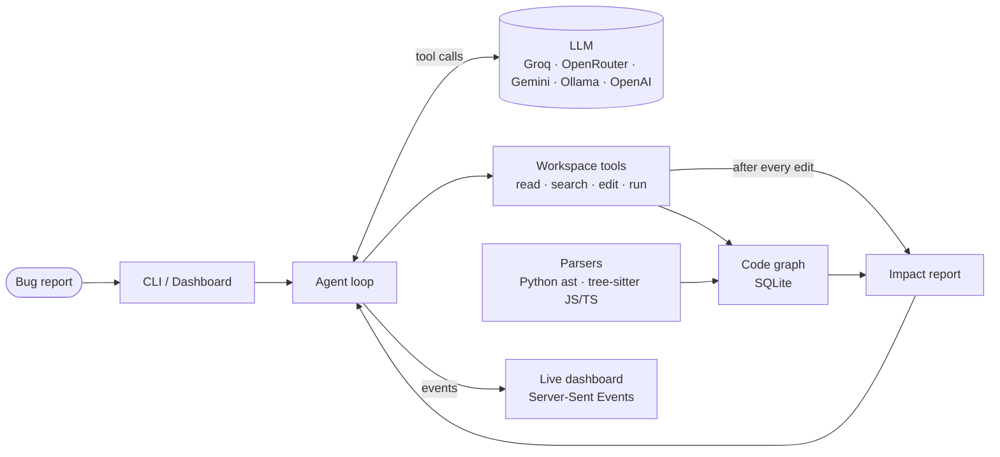

<div align="center">

# 👻 GhostPatch

### An AI software engineer that understands how your code connects.

Describe a bug, or let it find one. GhostPatch maps the codebase into a live graph, finds the
root cause, writes the fix, works out everything the change could break, and proves it:
the new tests fail without the fix and pass with it.


[](https://github.com/Nitin23123/GhostPatch/actions/workflows/tests.yml)


<sub>A two-fix tournament on a checkout bug. The winner fixed the root cause and passed its rival's tests; the loser patched the symptom in the cart. The fix is proven red→green, and the poltergeist couldn't break it.</sub>

</div>

---

## The problem

AI coding agents are good at writing code, but most of them explore a repository the way
a newcomer would: by searching text and opening files one at a time. They find the line
that looks wrong, patch it, and move on, without knowing what *else* depends on that line.

That is how a "fix" to a discount calculation quietly changes wholesale invoicing too.

## The idea

**GhostPatch gives the agent a map before it touches anything.**

It parses the codebase into a graph of files, classes, functions, tests and who-calls-what,
keeps that graph in sync as files change, and puts it at the centre of the agent's work:

- The agent starts every task with an **outline of the whole repository**.
- It can ask structural questions: *where is this defined, who calls it, which tests cover it?*
- **Every edit is automatically followed by an impact report**: what depends on the changed
  function, how far the change ripples, and exactly which tests to run. The agent gets this
  whether or not it thought to ask. That matters most with smaller, free models.

## Proof, not promises

An AI saying "fixed, and the tests pass" is a claim. GhostPatch checks it itself.

- **🔴→🟢 Red-green proof.** After every fix, GhostPatch runs the new tests twice: with the fix
  taken back out (they must fail) and with it in place (they must pass). Tests that pass either
  way prove nothing, and it says so.
- **🏆 Fix tournament.** With `--candidates 3`, independent fixes compete, each with its own
  strategy: direct, test first, or graph first. They are judged on evidence: their proofs, their
  confidence scores, and cross-examination, where every fix must also pass its rivals' tests.
  A patch that only fixes the reported symptom loses to one that fixes the root cause.
- **👻 Poltergeist.** A second agent that may only write tests then tries to break the winner.
- **The proof ships with the pull request**: the red and green test results, the confidence
  score and the tournament table are in its description.

## It hunts bugs while you sleep

- **Haunt mode** (`ghostpatch haunt`) finds bugs nobody has reported. It ranks every function
  by risk (how many places call it, whether any test reaches it, how often its file changed
  lately) and sends a haunter that may only write tests at the riskiest ones. GhostPatch runs
  those tests itself, and a skeptic, a separate model call with no stake in the claim, must agree
  that a failing test reflects what the code is meant to do before the bug counts. Every confirmed
  bug comes with its failing test as proof, and one click fixes it.
- **Night shift** (`ghostpatch nightshift`) works through every open issue labelled `ghostpatch`.
  It opens a pull request for each fix it can prove, rolls back the ones it can't, haunts for new
  bugs, and leaves a morning report. On GitHub Actions it runs every night for free.
- **Label an issue, get a pull request.** With the GitHub Action, adding the `ghostpatch` label to
  an issue is all it takes.

<p align="center">
  
  
</p>
<p align="center"><sub>Left: haunt mode found the coupon bug without being told about it. Right: ask mode answers from the code and draws the real call flow.</sub></p>

## Ask it anything

`ghostpatch ask "How does checkout calculate the total?"` answers from the code with a
read-only agent that cites `path:line`. GhostPatch then draws the call flow between the
functions the answer mentions, taken from the code graph rather than the model's memory, and
highlights it in the dashboard.

## See it work

GhostPatch has been tested end to end on three demo projects, using **free** models:

| Bug | Language | What GhostPatch did | Steps | Cost |
|---|---|---|---|---|
| `average()` returns the wrong mean | Python | Found the off-by-one slice, fixed it, added 3 tests | 9 | $0 |
| A 10% coupon charges customers **$0.00** | Python, 5 files | Traced checkout → cart → pricing, fixed `/ 10` → `/ 100`, flagged that **bulk invoicing** shares the function, added coupon tests | 9–13 | $0 |
| Buying 3 mugs only charges for 1 | TypeScript | Fixed the subtotal, flagged the **free-shipping** rule as affected, added a regression test, ran `node --test` | 7 | $0 |

What the agent sees right after its edit in the second case, generated by the code graph:

```text
🕸 Code graph: you changed shop.pricing.apply_discount.
Changing 'apply_discount' may affect:
  direct callers:
    shop/cart.py:15  in shop.cart.Cart.total
    shop/invoice.py:11  in shop.invoice.bulk_price
  callers of those:
    shop/checkout.py:7  in shop.checkout.checkout
  tests to run: tests/test_cart.py::test_checkout_receipt, tests/test_cart.py::test_total_without_coupon_adds_tax
```

## Benchmark (early results)

`bench/` holds 10 realistic bug cases (7 Python, 3 TypeScript). Each is judged by **hidden tests the
agent never sees**, and several are traps where fixing only the symptom fails, such as a broken helper
shared by receipts and the CSV export. First 5 cases, on the free `qwen/qwen3.8-27b` via Groq:

| Case | with graph | without graph |
|---|---|---|
| `py-calculator` | ✅ 7 steps | ✅ 6 steps |
| `py-deep-merge` (trap) | ✅ 6 steps | ✅ 6 steps |
| `py-mutable-default` | ✅ 5 steps | ✅ 7 steps |
| `py-pagination` | ✅ 5 steps | ✅ 6 steps |
| `py-price-format` (trap) | ✅ 4 steps | ✅ 7 steps |
| **Solved** | **5/5** | **5/5** |

Both settings solved every case so far. With the graph the agent needed **16% fewer steps** (27 vs 32)
but used **8% more tokens** (75.6k vs 69.9k), because the repository map and impact reports add
context. The remaining cases run as the free daily quota allows: `ghostpatch bench --compare`
resumes where it stopped, and `ghostpatch bench --report` prints the table.

## Features

**🕸 Living code graph.** Python, JavaScript and TypeScript are parsed into symbols and calls,
stored in SQLite and re-indexed incrementally: only changed files are re-parsed. JS/TS test
blocks such as `test("adds tax", () => …)` become named graph nodes, so impact reports name
real tests.

**🤖 Autonomous agent loop.** The agent explores, reproduces the bug, fixes the root cause,
verifies it with the project's own tests and writes a summary. It has 14 tools, from
`read_file` and `replace_lines` to `impact_of_change` and `remember`.

**👻 Live dashboard.** `ghostpatch serve` streams the agent's work to the browser as it
happens: every file read, every edit as a diff, every test run. The code graph lights up in
real time, and commands can be approved or denied with a click.

<p align="center">
  
  
</p>
<p align="center">
  
</p>

**💸 Free by default.** Works with Groq, OpenRouter, Google Gemini and local Ollama models at
no cost, or OpenAI when you want more power. It is built for free-tier realities: it waits out
per-minute limits, switches provider when a daily quota runs out, and shortens old tool output so
each request stays small.

**⬆ GitHub-native.** Point it at an issue link and it reads the issue, fixes it and opens a pull
request that says `Fixes #42`, committing only its own changes on a fresh branch. It works
through the GitHub CLI, so it never touches a GitHub token.

**↩ Undo anything.** Every run is recorded with the before-and-after content of each file it
touched. `ghostpatch undo`, or one click in the dashboard, puts everything back, including
deleting files the run created. It refuses to overwrite edits you made afterwards unless you insist.

## More superpowers

| | Feature | What it does |
|---|---|---|
| 👻 | **Poltergeist mode** | After a fix, an adversarial agent that may only write tests tries to *break* it, armed with the diff and the fix's blast radius. If it succeeds, the ghost gets its failing tests and fixes the code again. `--poltergeist` |
| 🧭 | **Crash-to-graph tracing** | Paste a Python or Node/TypeScript stack trace and it is mapped onto the code graph: the ghost starts from the exact crash path, and the dashboard can animate it. `ghostpatch trace` |
| 🩺 | **Blast-radius PR review** | For any change, including pull requests written by people: which functions changed, what else they affect, and which of those no test reaches. `ghostpatch review 42 --post` |
| 🤖 | **CI auto-fixer** | When CI goes red, GhostPatch fixes the code, re-runs the tests itself, then opens a pull request. Ships as a GitHub Action. `ghostpatch ci-fix` |
| 🎬 | **Replay and share** | Every run is recorded step by step. Export one as a single HTML page with a replay scrubber that anyone can open. `ghostpatch share` |
| 🕳 | **Test-gap map** | Every function no test reaches, and one command to have the ghost write tests for them. `ghostpatch gaps --write-tests 5` |
| ⏳ | **Architecture time-lapse** | The code graph at each of the last N commits, read straight from git, with what appeared and disappeared. `ghostpatch timelapse` |
| 🔀 | **Free-model fallback** | When one provider's daily quota runs out mid-fix, it switches to the next free provider and carries on with the same conversation. |
| 🧠 | **Repo memory** | Team conventions in `GHOSTPATCH.md`, plus facts the ghost learns as it works, fed into every run. `ghostpatch memory` |
| 📊 | **Confidence score** | Every fix gets 0 to 100: did the tests pass *after* the last edit, and how much of the blast radius do tests actually reach? |

**🛡 Safe by design.** File access is confined to the repository and nothing is committed or
pushed. Commands follow an approval mode: `ask` (always ask), `safe` (recognised test and
read-only git commands run automatically; anything that chains, redirects or substitutes
commands still asks) or `all` (for sandboxes). The dashboard binds to `127.0.0.1`, rejects
cross-site requests and checks the `Host` header against DNS rebinding.

## Architecture



| Module | Responsibility |
|---|---|
| `agent.py` | The reasoning loop: asks the model for the next action, executes it, feeds back the result |
| `session.py` | One fixing session end to end: tracing, the ghost or a tournament, poltergeist, proof, confidence, history |
| `proof.py` | Red-green proof: runs the new tests without and with the fix |
| `tournament.py` | Competing candidate fixes, cross-examined with each other's tests |
| `haunt.py` | Risk ranking, the haunter, and the skeptic that confirms each bug |
| `nightshift.py` | The unattended issue queue, pull requests and the morning report |
| `ask.py` | Read-only answers and the call flow they describe |
| `tools.py` | The agent's hands: sandboxed file access, edits, commands, graph queries, impact notes |
| `graph.py` | The living graph: incremental SQLite index, callers, related tests, change impact |
| `parsers.py` | Turns Python (`ast`) and JS/TS (tree-sitter) into symbols, calls and imports |
| `server.py` + `web/` | The dashboard: standard-library HTTP server and a dependency-free single-page UI |
| `providers.py` | One OpenAI-compatible client for every model provider |

## Engineering notes

A few problems that shaped the design:

- **Free models are messy.** They invent argument names (`line_end` for `end_line`), prefix
  tool names (`repo_browser.read_file`), emit malformed JSON, and announce "done" in plain
  text instead of calling `finish`. GhostPatch normalises all of these instead of failing,
  which is what lets small free models complete real multi-file fixes.
- **Models don't always use the tools they're given.** Early runs showed a free model
  ignoring the graph tools entirely. Rather than prompting harder, the impact report is now
  **pushed** after every edit, so the graph's knowledge reaches the model regardless.
- **Graph identity has to survive edits.** Re-indexing a file gives its symbols new database
  IDs, so the dashboard tracks highlights by fully qualified name, not by ID.
- **Anonymous test callbacks are invisible to call graphs.** In JavaScript,
  `test("…", () => {…})` has no function name, so tests would never appear as callers.
  The parser turns test and suite blocks into named symbols.
- **No build step, no heavy dependencies.** The dashboard is plain HTML, CSS and JS with a
  hand-written force-directed graph layout, served by Python's standard library.

## Tech stack

**Python** · **SQLite** · **tree-sitter** · **OpenAI-compatible APIs** (Groq, OpenRouter, Gemini, Ollama, OpenAI) ·
**Server-Sent Events** · vanilla **HTML/CSS/JS** with SVG · **pytest** (184 tests, using a scripted
fake model and a fake GitHub CLI, so the suite needs no API key or network) · **GitHub Actions** CI on Windows, macOS and Linux

## Roadmap

- [x] Autonomous bug-fixing agent with sandboxed tools
- [x] Living code graph with automatic impact reports
- [x] JavaScript and TypeScript support
- [x] Live web dashboard
- [x] Free model providers
- [x] Undo, run history, approval modes, `init` and `doctor`
- [x] CI on Windows, macOS and Linux
- [x] GitHub integration: issue in, pull request out
- [x] Poltergeist mode, crash tracing, PR review, CI auto-fix, replay, test gaps, time-lapse, fallback, memory, confidence
- [x] Free-tier survival: provider fallback, readable quota errors, shortened history
- [x] Red-green proof, fix tournament, haunt mode, night shift, ask the graph
- [x] Label an issue, get a pull request (GitHub Action)
- [ ] Isolated git worktree for every run
- [ ] More languages: Go, Rust, Java
- [ ] Public benchmark results on SWE-bench

## Running it

```bash
pipx install ghostpatch            # or: uv tool install ghostpatch, or pip install ghostpatch
ghostpatch init                    # pick a free provider, paste a key, add a backup key
ghostpatch doctor                  # check everything is ready
ghostpatch serve                   # the dashboard, at http://localhost:8765
```

Keys are saved once in your user settings, so they work in every project. Free keys:
[Groq](https://console.groq.com/keys), [OpenRouter](https://openrouter.ai/keys) and
[Gemini](https://aistudio.google.com/apikey). Setting up two means a run carries on when one
provider's daily quota runs out.

| Command | What it does |
|---|---|
| `ghostpatch serve` | Live dashboard: describe a bug, watch it get fixed, undo with a click |
| `ghostpatch fix "…"` | Fix a bug from the terminal (`@ISSUE.md` reads the description from a file) |
| `ghostpatch fix "…" --candidates 3` | A fix tournament: three independent fixes compete and the best-proven one wins |
| `ghostpatch fix <issue link> --pr` | Fix a GitHub issue and open a pull request when the fix is verified |
| `ghostpatch haunt` | Hunt for unreported bugs in the riskiest functions (`--list` shows the ranking, `--fix` fixes them) |
| `ghostpatch nightshift --approve safe` | Fix every issue labelled `ghostpatch`, haunt, and write a morning report |
| `ghostpatch ask "…"` | Ask a question about the code; get an answer and the real call flow |
| `ghostpatch pr` | Open a pull request for the latest run (or any run) |
| `ghostpatch history` / `undo` | List past runs / roll one back |
| `ghostpatch graph impact NAME` | Ask the code graph what a change would affect (also `map`, `callers`, `tests`, …) |
| `ghostpatch review [PR]` | Blast-radius review of your changes or a pull request (`--post` comments on it) |
| `ghostpatch trace crash.txt --fix` | Map a stack trace onto the code graph, then fix the crash |
| `ghostpatch gaps` | Functions no test reaches (`--write-tests N` has the ghost cover them) |
| `ghostpatch ci-fix --mode pr` | For CI: if the tests fail, fix them and open a pull request |
| `ghostpatch share` / `timelapse` / `memory` | Export a run as HTML / replay the architecture / show what it remembers |
| `ghostpatch bench --compare` | Run the benchmark with and without the code graph |
| `ghostpatch init` / `doctor` | Set up a provider and key / check the setup |

Add `--approve safe` to let test runs go ahead without asking, and `--poltergeist` to have every
fix attacked before you see it.

**On GitHub, for free**, copy one of these into `.github/workflows/`:
[fix failing CI](https://github.com/Nitin23123/GhostPatch/blob/main/docs/ci-autofix-example.yml),
[label an issue, get a pull request](https://github.com/Nitin23123/GhostPatch/blob/main/docs/issue-label-example.yml) or
[the nightly night shift](https://github.com/Nitin23123/GhostPatch/blob/main/docs/nightshift-example.yml).

More detail in [CONTRIBUTING.md](https://github.com/Nitin23123/GhostPatch/blob/main/CONTRIBUTING.md).

## License

[MIT](https://github.com/Nitin23123/GhostPatch/blob/main/LICENSE)
